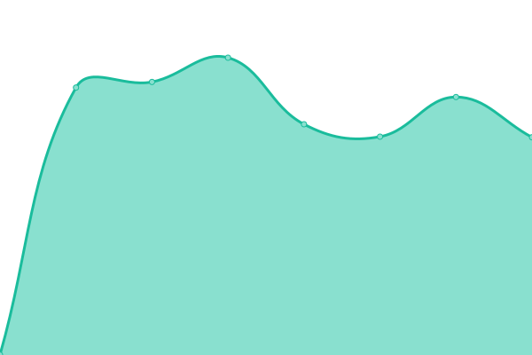
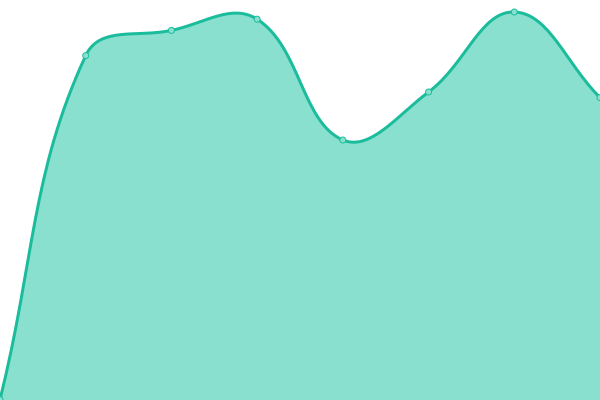
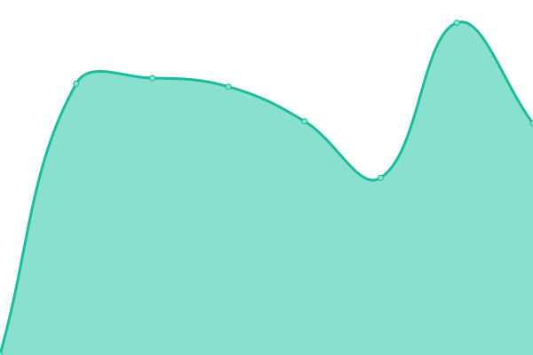
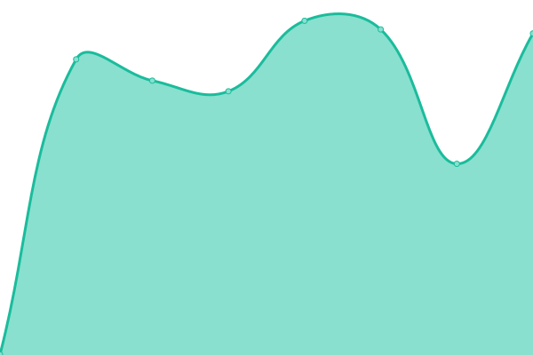

# [📈 Live Status](https://demo.upptime.js.org): <!--live status--> **🟧 Partial outage**

This repository contains the open-source uptime monitor and status page for [Anthony](https://demo.upptime.js.org), powered by [Upptime](https://github.com/upptime/upptime).

With [Upptime](https://upptime.js.org), you can get your own unlimited and free uptime monitor and status page, powered entirely by a GitHub repository. We use [Issues](https://github.com/kuggar-anthony/upptime/issues) as incident reports, [Actions](https://github.com/kuggar-anthony/upptime/actions) as uptime monitors, and [Pages](https://demo.upptime.js.org) for the status page.

<!--start: status pages-->
<!-- This summary is generated by Upptime (https://github.com/upptime/upptime) -->
<!-- Do not edit this manually, your changes will be overwritten -->
<!-- prettier-ignore -->
| URL | Status | History | Response Time | Uptime |
| --- | ------ | ------- | ------------- | ------ |
|  [Kuggar API](https://api.kuggar.io/api/v2/ping) | 🟩 Up | [kuggar-api.yml](https://github.com/kuggar-anthony/upptime/commits/HEAD/history/kuggar-api.yml) | 

 864ms
     
 | 

<a href="https://status.kuggar.io/history/kuggar-api">100.00%</a>
    

|  [Kuggar API - Azure (Australia East)](https://kuggar-prod-au-api.azurewebsites.net/api/v2/ping) | 🟥 Down | [kuggar-api-azure-australia-east.yml](https://github.com/kuggar-anthony/upptime/commits/HEAD/history/kuggar-api-azure-australia-east.yml) | 

 0ms
     
 | 

<a href="https://status.kuggar.io/history/kuggar-api-azure-australia-east">100.00%</a>
    

|  [Kuggar API - AWS (Sydney)](http://kuggarprodauapiv2-env.eba-yzpksewj.ap-southeast-2.elasticbeanstalk.com/api/v2/ping) | 🟩 Up | [kuggar-api-aws-sydney.yml](https://github.com/kuggar-anthony/upptime/commits/HEAD/history/kuggar-api-aws-sydney.yml) | 

 394ms
     
 | 

<a href="https://status.kuggar.io/history/kuggar-api-aws-sydney">100.00%</a>
    

|  [Platform API - Azure (Australia East)](https://platform.az.au.kuggar.io/api/v2/codes/currency) | 🟩 Up | [platform-api-azure-australia-east.yml](https://github.com/kuggar-anthony/upptime/commits/HEAD/history/platform-api-azure-australia-east.yml) | 

 782ms
     
 | 

<a href="https://status.kuggar.io/history/platform-api-azure-australia-east">100.00%</a>
    

|  [Platform API - AWS (Sydney)](https://platform.aws.au.kuggar.io/api/v2/codes/currency) | 🟩 Up | [platform-api-aws-sydney.yml](https://github.com/kuggar-anthony/upptime/commits/HEAD/history/platform-api-aws-sydney.yml) | 

 814ms
     
 | 

<a href="https://status.kuggar.io/history/platform-api-aws-sydney">100.00%</a>
    

|  [Virtual.Cards API - Azure (Australia East)](https://virtualcards.az.au.kuggar.io/api/v2/virtual_card/list) | 🟩 Up | [virtual-cards-api-azure-australia-east.yml](https://github.com/kuggar-anthony/upptime/commits/HEAD/history/virtual-cards-api-azure-australia-east.yml) | 

 829ms
     
 | 

<a href="https://status.kuggar.io/history/virtual-cards-api-azure-australia-east">100.00%</a>
    

|  [Virtual.Cards API - AWS (Sydney)](https://virtualcards.aws.au.kuggar.io/api/v2/virtual_card/list) | 🟩 Up | [virtual-cards-api-aws-sydney.yml](https://github.com/kuggar-anthony/upptime/commits/HEAD/history/virtual-cards-api-aws-sydney.yml) | 

 849ms
     
 | 

<a href="https://status.kuggar.io/history/virtual-cards-api-aws-sydney">100.00%</a>
    

|  [Customer Portal](https://portal.kuggar.io/index.html) | 🟩 Up | [customer-portal.yml](https://github.com/kuggar-anthony/upptime/commits/HEAD/history/customer-portal.yml) | 

 452ms
     
 | 

<a href="https://status.kuggar.io/history/customer-portal">100.00%</a>
    

|  [Customer Portal - Azure (Australia East)](https://ambitious-bush-0f1487400.1.azurestaticapps.net/index.html) | 🟥 Down | [customer-portal-azure-australia-east.yml](https://github.com/kuggar-anthony/upptime/commits/HEAD/history/customer-portal-azure-australia-east.yml) | 

 107ms
     
 | 

<a href="https://status.kuggar.io/history/customer-portal-azure-australia-east">100.00%</a>
    

|  [Customer Portal - AWS (Sydney)](http://kuggar-prod-web-cp.s3-website-ap-southeast-2.amazonaws.com/index.html) | 🟩 Up | [customer-portal-aws-sydney.yml](https://github.com/kuggar-anthony/upptime/commits/HEAD/history/customer-portal-aws-sydney.yml) | 

 457ms
     
 | 

<a href="https://status.kuggar.io/history/customer-portal-aws-sydney">100.00%</a>
    

|  [MongoDB Atlas](https://status.cloud.mongodb.com/api/v2/status.json) | 🟩 Up | [mongo-db-atlas.yml](https://github.com/kuggar-anthony/upptime/commits/HEAD/history/mongo-db-atlas.yml) | 

 386ms
     
 | 

<a href="https://status.kuggar.io/history/mongo-db-atlas">100.00%</a>
    

|  [Fixer.io (Foreign Exchange API)](https://data.fixer.io/api/) | 🟩 Up | [fixer-io-foreign-exchange-api.yml](https://github.com/kuggar-anthony/upptime/commits/HEAD/history/fixer-io-foreign-exchange-api.yml) | 

 244ms
     
 | 

<a href="https://status.kuggar.io/history/fixer-io-foreign-exchange-api">100.00%</a>
    

|  [Virtual Card Provider - Nium](https://payments.nium.com/commons/auth/login) | 🟩 Up | [virtual-card-provider-nium.yml](https://github.com/kuggar-anthony/upptime/commits/HEAD/history/virtual-card-provider-nium.yml) | 

 565ms
     
 | 

<a href="https://status.kuggar.io/history/virtual-card-provider-nium">100.00%</a>
    

<!--end: status pages-->

[**Visit our status website →**](https://demo.upptime.js.org)

## 📄 License

- Powered by: [Upptime](https://github.com/upptime/upptime)
- Code: [MIT](./LICENSE) © [Anthony](https://demo.upptime.js.org)
- Data in the `./history` directory: [Open Database License](https://opendatacommons.org/licenses/odbl/1-0/)
